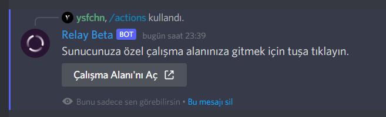
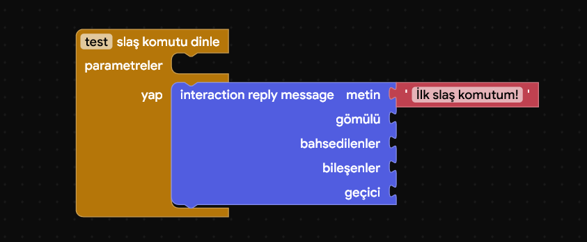
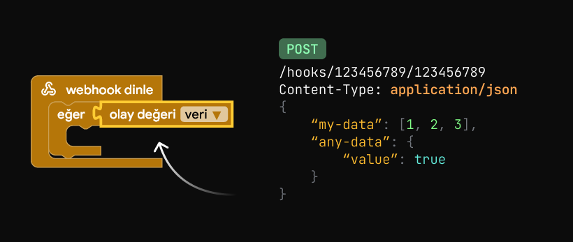

--8<-- "article_wip.txt"

# Actions {: #title }

Relay Actions, sunucu moderatörlerinin Relay'e istediği gibi komut vermelerine olanak tanıyan bir özelliktir. Üstelik tek satır kod yazmadan. Relay'in çekirdeğini oluşturan ve Relay Paketlerinin koduna güç veren şey aynı zamanda budur.

!!! warning "Yetki gerekli"
    Relay'i kontrol edebilmek için sunucuda "Yönetici" izninizin olması gerekiyor. Eğer izniniz yoksa, sizden daha yetkili birine bu işlemi yapmasını isteyin.

---

Sunucunuzda herhangi bir olay gerçekleştiğinde, Relay'e kendi belirlediğiniz komutları sırasıyla çalıştırmasını isteyebilirsiniz. Bu sayede sunucunuzdaki diğer botların size kendi istediklerini yaptırlamalarından ve vaktinizi o botların kullanımını öğrenmekle harcamaktan kurtulmuş olursunuz.

Sunucunuzda gerçekleşebilecek olan "olaylar" Discord'da yapılan herhangi bir aktivite olabilir. Bir kanala mesaj atılması, birinin sunucudan yasaklanması veya bir kanalın düzenlenmesi, bu olayların sadece birkaçına örnektir. Hangi durumda hangi işlemi yaptırmak istediğiniz size kalmış.

     
    Örneğin, seçtiğiniz bir mesaja tepki eklendiğinde Relay'in o kullanıcıya yine seçtiğiniz bir rolü vermesini sağlayabilirsiniz.

---

## Giriş {: #introduction }

Site üzerinden

Relay'in [yönetim paneline :octicons-link-external-16:](https://app.relay.ysfchn.com/workspaces){ target="_blank" } giderek yetkiye sahip olduğunuz ve Relay'in bulunduğu tüm sunucularınızı görebilirsiniz. Bir sunucunun editörüne girmek için sunucu isminin sağındaki "Aç" tuşuna tıklayın.

[**Yönetim paneline git**](https://app.relay.ysfchn.com/workspaces){ .md-button .md-button--primary .primary-button style="margin-bottom: 10px;" target="_blank" }

Discord içinden

Sunucudaki olay akışlarını düzenlemeye yarayan editöre girmek için `/actions` komutunu kullanın ve Relay'in size gönderdiği bağlantıya tıklayarak Blok Editörü'nü açın.

---

## Blok Editörü {: #editor }

!!! warning "Blok editörü henüz önizleme aşamasındadır"
    Halihazırda çoğu şeyin çalışması gerekmektedir, fakat yine de küçük veya büyük hatalarla karşılaşmanız olasıdır. Lütfen bunları bildirmeyi unutmayın!

Relay Actions ile Relay'e yapılacak eylemleri, tek satır kod yazmadan sürükleyerek ve bırakarak kodlayabilirsiniz. Blok düzenleyicisi, Google tarafından, blok tabanlı programlama dilleri oluşturmayı sağlayan "Blockly" adındaki bir kütüphanenin üstüne inşa edilmiştir.

Relay'in kendi içinde ortalama bir Discord sunucusunda yapabileceğiniz çoğu işlem önceden eklenmiştir. Bunları kullanmak için sadece ilgili bloğu çalışma alanınıza eklemeniz yeterlidir. Aynı zamanda metin, sayı gibi işlemleri gerçekleştirmeniz için de standart bloklar bulunur. Bunların hepsini çeşitli kategoriler altında görebilirsiniz.

Örneğin, mesaj göndermek için "mesaj gönderme" bloğunu kullanabilir, gönderilen mesajı almak için "olay" bloklarından yararlanabilir ve daha fazlasını yapabilirsiniz! Kaydetme tuşuna her bastığınızda bu değişiklikler anında Relay'e yüklenir.

    

1.  Kategoriler; her kategori farklı bloklar içerir.
2.  Bir kategoriye tıkladığınızda içinde gözüken bloklar burada gözükür.
3.  Çalışma alanı; bloklar buraya yerleştirilir.
4.  Çalışma alanı kontrolleri; çöp kutusu, yakınlaştırma ve uzaklaştırma.
5.  Çalışma alanı üst çubuğu; blokları burada kaydedebilir, yardımı açabilir, katılımcıları görüntüleyebilir ve sohbete erişebilirsiniz.

    <video src="assets/actions_blockly_demo.mp4" width="800" controls>

---

## Ortak Çalışma {: #collab }

Farklı kişiler aynı çalışma alanında gerçek zamanlı olarak çalışabilir. Ortak çalışmaya başlamak için aynı çalışma alanını birden fazla kişinin açması yeterlidir.  

* Yeni bir üye katıldığında veya ayrıldığında ekranın tepesinden mesaj alırsınız.
* Yapılan değişiklikler, aynı çalışma alanında bulunan diğer kişilere yansıtılır, aynı şekilde onların değişiklikleri de size yansıtılır.
* "Kaydet" tuşu, şimdilik ortak çalışma özelliğinden bağımsız bir şekilde çalışmaktadır. Ortak Çalışma bağlantısı koparsa normal şekilde kaydetmeye devam edebilirsiniz. Fakat bu durumda ilk kim kaydederse onun değişikliklerinin kaydedileceğini unutmayın.

---

## Dinleyiciler {: #listeners }

Belirli bir olayı yakalamak ve o olayda ne yapılacağını belirlemek için dinleyici bloklarını kullanın. Bu dinleyici blokların içinde olmayıp, dışında kalan diğer bloklar görmezden gelinir.

Dinleyici blokları "sarı" renklidir ve tüm dinleyici blokları "Akış" kategorisinden bulunabilir. Her dinleyici bloğunun kendi özelliği vardır, fakat hepsinin ortak bir noktası vardır, sunucunuzdaki diğer insanların yaptığı eylemleri yakalar. (biz bu "yakalama" işleminde "dinlemek" diyoruz, bu yüzden bu blokların türü "Dinleyici".)

    

Dinleyiciler herhangi bir tepki aldığında (yani çalıştırıldığında) doğal olarak içinde veriler de barındırır. Bu verilere erişmek için "olay değeri" bloğunu kullanın.

Bu bloğun içindeki seçenekler, içine koyduğunuz dinleyici bloğuna göre yenilenir. Bu yüzden bu bloğun içinde herhangi bir seçenek görmüyorsanız, ilk önce onu bir dinleyici bloğunun içine yerleştirin.

Eğer "Mesaj Gönderme" olayı gerçekleştiğinde mesajı gönderen kişiyi komple almak istiyorsanız "mesaj > sahip" seçeneğini seçebilir, veya o kişiden sadece belirli bir veriyi almak istiyorsanız diğer seçenekleri de seçebilirsiniz.

---

## Etkileşimler {: #interactions }

"Etkileşimler" (İngilizce: "Interactions"); Discord'un tanımıyla, Eğik Çizgi Komutları (Slash Commands), Mesaj Bileşenleri (Message Components) ve Bağlam Menüsü (Context Menu) gibi etkileşime dayalı özelliklerin tek çatı altında toplandığı bir bot iletişim türüdür. Relay de bu etkileşimleri bütünüyle destekler!

Etkileşimleri kullanmak kolaydır, her zaman olduğu gibi blokları ekleyip birbirine bağlamanız yeterlidir. Ek bir ayar açmanız veya değiştirmeniz gerekmez, çünkü Relay gerisini halleder.

### Cevaplama {: #reply }

Herhangi bir etkileşime dayalı dinleyici kullandığınızda (bunlar "slaş komutu", "bağlam menüsü", "mesaj bileşeni" ve "diyalog cevabı" dinleyicileridir), Discord sizden **her defasında etkileşimlere cevap vermenizi zorunlu kılar.**

Etkileşimleri yanıtlamak için 3 saniyeniz vardır. Eğer etkileşimlere 3 saniye içinde cevap vermezseniz, kullanıcılar bu hata mesajını görür.

Eğer cevap vermenize rağmen yine de bu hata mesajını görüyorsanız, cevabınız 3 saniye içinde ulaşmıyor olabilir. Bunun başlıca sebepleri cevap bloğunu diğer bloklardan sonra çalıştırıyor olmanız veya Relay'de geçici olarak bir kesinti yaşanmasından olabilir.

Etkileşimleri tam olarak **1 kez cevaplamanız gerekir.** Birden fazla yanıtlamanız hataya yol açar. Etkileşimleri tam olarak 1 kez yanıtladıktan sonra 3 saniyelik limitiniz 15 dakikaya çıkar. Bu da demek oluyor ki, 15 dakika içinde istediğiniz şeyleri her zaman olduğu gibi Relay ile yapabilirsiniz.

Peki etkileşimlere nasıl cevap verebilirsiniz? Cevaplamak için kullanabileceğiniz birkaç seçeneğiniz var. 

#### Cevap yöntemleri {: #reply-types }

|  Tip   |   Açıklama   |  Blok  |  Discord'da gözüken  |
|:-------|:-------------|:------:|:-------------:|
| **Bekleme** | Hemen bir mesaj göndermek istenmediği zamanlarda, veya 3 saniyelik süre mesaj göndermek için yeterli değilse, kullanıcıya beklemesini isteyen bir cevap verir. İsteğinize göre mesajı gizli veya herkese açık yapabilirsiniz. | { width="1000" } | { width="1000" } |
| **Mesaj** | Etkileşim tetiklendiğinde mesaj gönderir. Bu sayede kullanıcılar belirttiğiniz mesajı görür. İsteğinize göre mesajı gizli veya herkese açık yapabilirsiniz. | { width="1000" } | { width="1000" } |
| **Diyalog** | Belirttiğiniz mesaj bileşenlerini içeren bir [diyalog](#modals) gösterir. Kullanıcılar, bu diyalog içinde gereken alanları doldurup diyaloğu gönderebilir. Gereken alanlar doldurup gönderildiğinde "diyalog cevabını dinle" dinleyicisi devreye girer.  Diyaloglar şimdilik sadece her satır için yalnızca bir yazı girişi bileşeni bulundurabilir. | { width="1000" } | { width="1000" } |

### Slaş Komutları {: #slash-commands }

Eğik Çizgi Komutları (biz kısaltmak için "Slaş Komutları" diyoruz), mesaj yazma alanına <kbd>/</kbd> (eğik çizgi) yazarak bir listesini görebildiğiniz komut tabanlı etkileşimlerdir.

Bu komutlara aynı zamanda isteğinize göre parametreler ekleyebilir ve bu parametreleri kullanıcının doldurmasını isteyebilirsiniz. Komut çalışınca da bu parametrelere elbette erişebilirsiniz. 

Yeni bir Slaş Komutu oluşturmak için slaş komut dinleyicisi ekleyin ve oluşturacağınız slaş komutun adını girin. Bu Slaş Komutu çalıştığında çalıştırılacak blokları "yap" kısmına ekleyebilirsiniz.

### Diyaloglar {: #modals }

Diyaloglar, kullanıcının cevap vermesini gerektirecek bileşenlerin bulunduğu bir pencere/form açar. 

Kullanıcılar, diyaloğu <kbd>Gönder</kbd> tuşu ile gönderdikten sonra "diyalog cevabını dinle" dinleyici bloğunda belirttiğiniz eylemler çalıştırılır. Diyaloğa nasıl cevap verirseniz verin Discord'da bir şey gözükmeyecektir. Fakat buna rağmen yine de etkileşime cevap vermeniz gerekir. Aksi takdirde kullanıcılar "Bir hata oluştu." mesajını görür.

Diyalogları isterseniz slaş komutu kullanıldıktan sonra gösterebilirsiniz veya mesaj bileşeni tetiklendiğinde (butona tıklamak gibi) de gösterebilirsiniz.

Diyaloglar an itibariyle özellik bakımından fazla kısıtlılardır. Sadece metin bileşenleri eklenebilir, birden fazla üst üste diyalog zincirlenemez ve diyalog etkileşimleri bekletilemez.

---

## Kayıtlar {: #logs }

Olay akışınız her çalıştığında başarılı olup olmadığı veya başarısız ise nerede hata çıktığını anlık olarak görmek için Kayıt Görüntüleyici'yi kullanın.

Bir dinleyici bloğunun (sarı tonlu, içine blok eklenebilen geniş blok) üstüne sağ tıklayıp <kbd>Canlı kayıtları görüntüle</kbd> tuşuna basın. Ardından (eğer izin istenirse) açılır pencereye izin vererek Kayıt Görüntüleyici'sine ulaşabilirsiniz.

Eğer bu seçeneği görmüyorsanız yanlış bloğa sağ tıklıyor olabilirsiniz. Bu seçeneğin sadece dinleyici blokları için gözüktüğünü unutmayın.

Kayıt Görüntüleyicisi bu şekilde gözükür. Bloklardan biri hata verdiğinde veya sorunsuz çalıştığında ekrana yeni girdi eklenir. İstediğiniz zaman kaydı durdurabilir veya yeniden başlatabilirsiniz.

Kaydı durdurduğunuzda kayıtlar silinmez. Fakat kaydın yeniden başlatılması, sayfanın yenilenmesi, sayfanın kapanması gibi durumda ekranda gözüken tüm eski kayıtlar kalıcı olarak yok olur. 

Hata çıkması durumda, hatanın basit bir ayrıntısını (bu çoğunlukla İngilizce dilindedir) görürsünüz. Sorunun nerede olduğunu anladığınızda, editöre geri dönüp hatayı düzeltebilir ve tekrardan kaydedebilirsiniz.

Farklı dinleyici blokları için aynı anda birden fazla Kayıt Görüntüleyicisi açabilirsiniz. Ayrıca unutmayın ki daha önceden çıkan hatalar gösterilmez, sadece kayıt penceresi açıldıktan sonra gelen hataları görürsünüz.

---

## Webhook {: #webhook }

Webhook sayesinde olay akışınız için özel bir URL'ye sahip olursunuz. Bu URL'ye HTTP POST isteği göndererek sunucunuzda belirttiğiniz bir olay akışını çalıştırabilirsiniz, üstelik HTTP isteğinde gönderdiğiniz veriye de erişebilirsiniz.

### Webhook'u etkinleştirme {: #webhook-enable }

Bir Webhook alıcısı oluşturmak için çalışma alanınıza bir Webhook dinleyicisi ekleyin (veya var olanı kullanın) ve çalışma alanınızı <kbd>Kaydet</kbd> tuşuna basarak kaydedin.

Ardından bloğa sağ tıkladığınızda <kbd>Webhook URL'sini kopyala</kbd> tuşuna tıklayın. Webhook'unuz artık kullanılmaya hazır demektir!

!!! warning "Webhook URL'nizi kimse ile paylaşmayın!"
    Sunucunuzda olsalar da olmasalar da, veya yetkisi olsalar da olmasalar da herhangi biri Webhook bağlantınızı öğrenirse, o bağlantıya istek atarak dinleyici bloğunun içindeki blokları onayınız olmadan çalıştırabilirler. Bu yüzden Webhook bağlantınızı güvenmediğiniz kimse ile paylaşmayın!

### Webhook'u kullanma {: #webhook-usage }

Webhook URL'sine gönderdiğiniz verilere "olay değeri" bloğu ile erişebilirsiniz. Gönderilen JSON verisi "veri" ("data") anahtarına kaydedilir. Bu değer ile birlikte Yapı bloklarını da kullanarak içteki anahtarları da okuyabilirsiniz.

    

Webhook'a istediğiniz yerde ve istediğiniz şekilde istek gönderebilirsiniz. Tarayıcı üzerinden örnek bir Webhook isteğini [burada :octicons-link-external-16:](https://hopp.sh/r/Lt7eh04DUHmx){ target="_blank" } bulabilirsiniz. Webhook URL'nizi kendi URL'niz ile değiştirmeyi unutmayın!

İstek göndermeden önce verinizin JSON biçiminde olduğuna ve verinizi "body" yani gövde bölümüne eklediğinize emin olun, aksi takdirde olay akışları tetiklenmeyecektir.

---

## Kısıtlamalar {: #limitations }

Ne yapabileceğiniz hakkında size daha fazla özgürlük tanımak istesek bile botun kaynak kullanımını aşırı derecede arttırmamak ve güvenliği korumak adına bazı eylemleri Relay'de gerçekleştiremeyebilirsiniz.

Bunlarla sınırlı olmamakla birlikte Relay'de yapamayacağınız bazı şeyler:

* Dosya oluşturamazsınız, dosya okuyamazsınız veya benzer giriş/çıkış işlemleri yapamazsınız.
* Sesli kanallara katılamazsınız veya dinleyemezsiniz.
* Her eylemde, kişi başına maksimum 1 defalığına özel mesaj gönderebiliirsiniz.
* Üyelerin kendilerini güncellemesini dinleyemezsiniz. (çevrimdışı olduklarında, kullanıcı adları değiştiğinde)
* "Yazıyor..." olayını dinleyemezsiniz ve "Yazıyor..." mesajı gösteremezsiniz.  