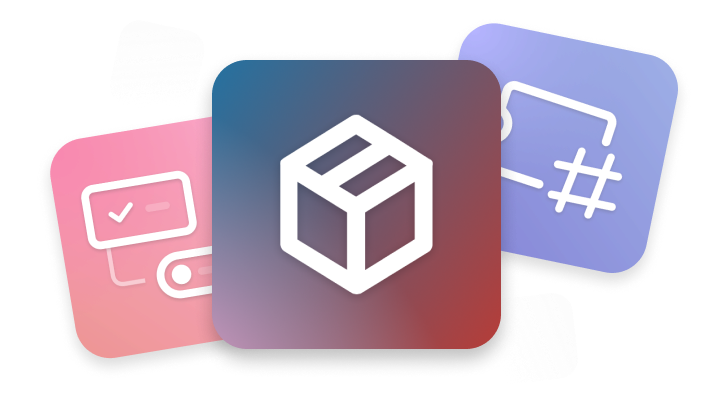

--8<-- "wip_banner.txt"

# Relay { style="margin-bottom: 10px;" }

Say "Hello" to a programmable Discord bot that can do anything[^1] you want on your server. Perform the actions you want without writing a single line of code using blocks. What you want to do is entirely up to you! 

Welcome to a new world.

> The development of Relay is not finished yet, but we still want to give you a chance to use the bot. You can start using Relay on your own server as soon as possible by applying now!

[**Apply to public beta program (Turkish)**](/tr/apply){ .md-button .md-button--primary .primary-button style="margin-bottom: 10px;" target="_blank" }   [**Open server dashboard**](https://app.relay.ysfchn.com/workspaces/){ .md-button .secondary-button target="_blank" }

  

Keeping up with the latest changes

Relay's code is getting more and more modular by the day. This naturally makes it easier for us to add new features to the bot. When Discord adds new features for all bots and we think adding these features is appropriate for Relay, we will add the new feature at the same time or as soon as possible.[^2]

[**:octicons-issue-reopened-16: &nbsp; See what's new**](changelog/)

 

Need to hurry? Try ready-made packages

If you are not yet ready to program Relay from scratch, you can effortlessly install published Relay Packages on your own servers. These packs can be developed by both us and the community, this means you can also develop your own pack!

[**:octicons-package-16: &nbsp; Start using packages (Soon)**](#){ style="opacity: 0.3;" }

 

Use with your own brand identity

If your Discord server has a brand or business and you want to use Relay with your own brand name, you can customize the Relay's profile picture and/or name on your own server (also known as "whitelabeling").

[**:octicons-note-16: &nbsp; Introduction to white-labeling (Soon)**](#){ style="opacity: 0.3;" }

[^1]:
    Of course, in addition to the fact that you cannot make Relay perform "meaningless" actions such as deleting a webhook, leaving the server by itself, some actions may not be available in Relay in order to protect the security of the Relay and not cause performance problems. See what you can't do in Relay [here.](actions#limitations)

[^2]:
    Although we would like to see new features in Relay as soon as possible, unfortunately we cannot give a 100% guarantee. Relay started out as a serious project, however it is being developed as a hobby. 