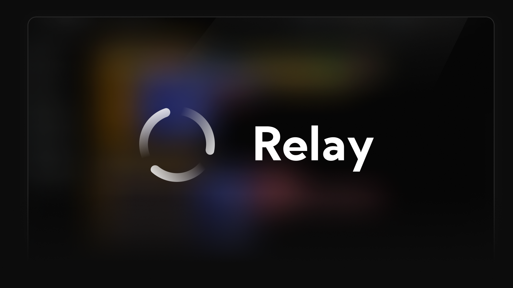
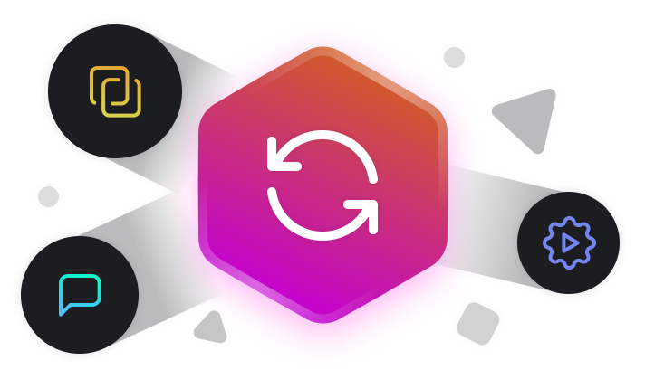
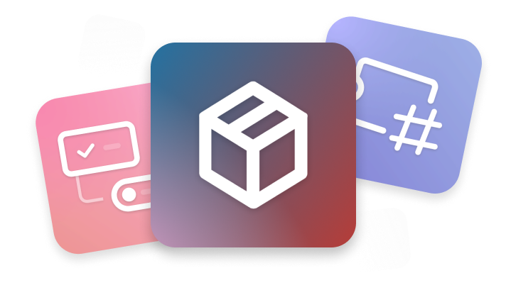
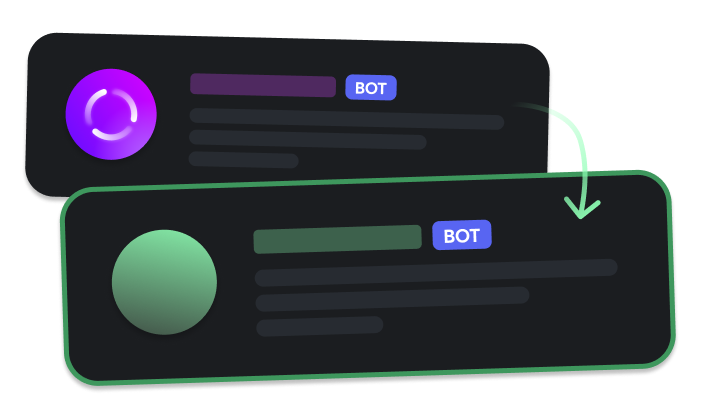

# Relay { style="margin-bottom: 10px;" }

Sunucunuzda istediğiniz herhangi[^1] bir şeyi yapabilen, programlanabilir bir Discord botuna "Merhaba" deyin. Blokları kullanarak tek satır kod yazmadan istediğiniz eylemleri gerçekleştirin. Ne yaptırmak istediğiniz tamamen size kalmış! 

Yeni bir dünyaya hoş geldiniz.

> Relay'in geliştirilmesi henüz sona ermedi, fakat yine de botu kullanmanıza olanak sağlamak istiyoruz. Hemen başvurarak en kısa sürede kendi sunucunuzda Relay'i kullanmaya başlayabilirsiniz!

[**Halka açık beta programına başvurun**](/tr/apply){ .md-button .md-button--primary .primary-button style="margin-bottom: 10px;" target="_blank" }   [**Yönetim panelini aç**](https://app.relay.ysfchn.com/workspaces/){ .md-button .secondary-button target="_blank" }

  

Yeni özellikler, tam vaktinde

Relay'in kodu gün geçtikçe daha da modüler hale geliyor. Bu da haliyle yeni özellikleri bota eklememizi kolaylaştırıyor. Discord, tüm botlar için yeni özellikler eklediği zaman ve bu özellikleri eklemenin Relay için uygun olduğunu düşündüğümüzde, yeni gelen özelliği aynı vakit içinde veya en kısa zamanda ekleriz.[^2]

[**:octicons-issue-reopened-16: &nbsp; Yenilikleri görüntüle**](changelog/)

 

Zamanınız yoksa, hazır paketleri deneyin

Eğer sıfırdan Relay'i programlamaya henüz hazır değilseniz, diğer insanların halka açık olarak paylaştığı Relay Paketlerini kendi sunucularınıza zahmetsizce yükleyebilirsiniz. Bu paketler, hem biz hem de topluluk tarafından geliştirilebilir, yani siz de kendi paketinizi geliştirerek çeşitliliği arttırmamıza yardımcı olabilirsiniz!

[**:octicons-package-16: &nbsp; Paketleri kullanmaya başlayın (Yakında)**](#){ style="opacity: 0.3;" }

 

Kendi markanızın kimliği ile kullanın

Eğer Discord sunucunuzun bir markası veya işletmesi varsa ve Relay'i kendi markanızın adıyla kullanmak istiyorsanız, Relay'in profil resmini ve/veya adını kendi sunucunuzda değiştirerek ("whitelabel") özelleştirebilirsiniz.

[**:octicons-note-16: &nbsp; Beyazetiket özelliklerine giriş (Yakında)**](#){ style="opacity: 0.3;" }

[^1]:
    Elbette webhook silmek, kendi kendine sunucudan çıkmak gibi "bir anlamı olmayan" eylemleri Relay'e yaptıramamanıza ek olarak Relay'in güvenliğini korumak ve performans sorunları açmaması adına bazı eylemler Relay'de kullanılamayabilir. Relay'de yapamayacağınız şeyleri [buradan görebilirsiniz.](actions#limitations)

[^2]:
    Her ne kadar biz de yeni özellikleri en kısa sürede Relay'de görmek istesek de bunun ne yazık ki %100 garantisini veremeyiz. Relay, ciddi bir proje olarak ortaya çıkmasına rağmen hobi olarak geliştiriliyor. 