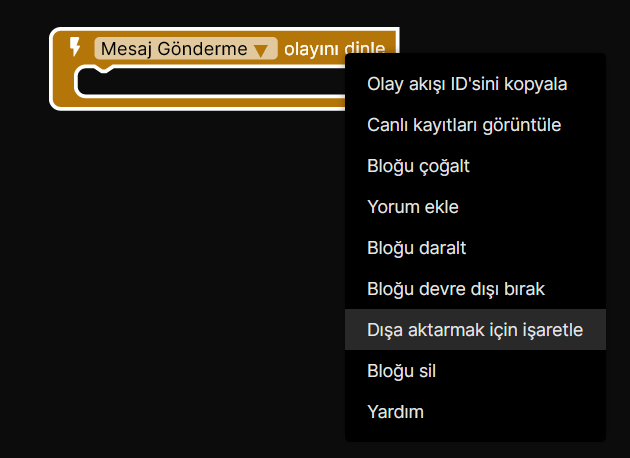
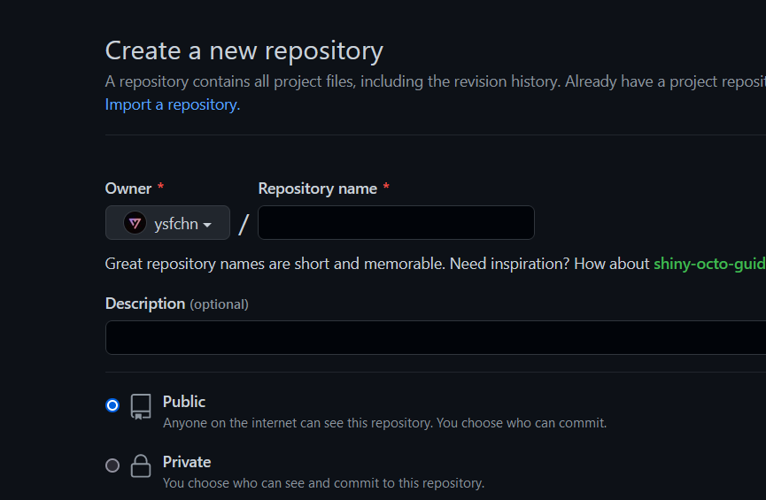
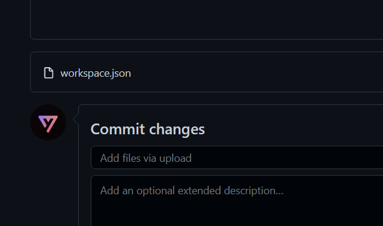
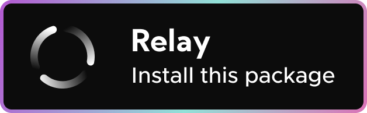
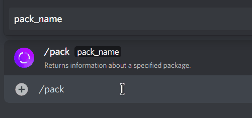
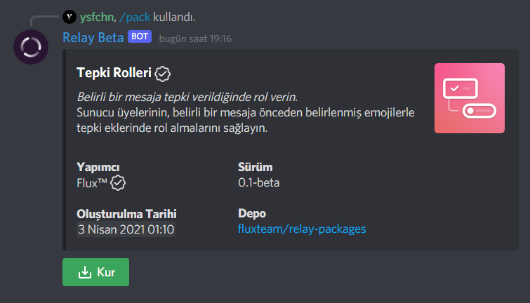
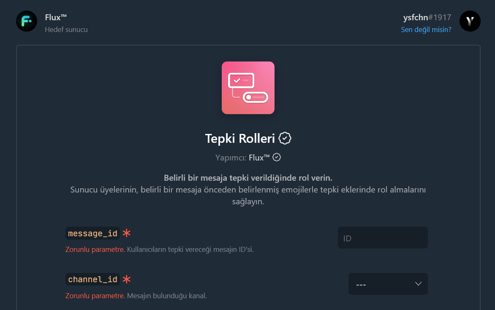
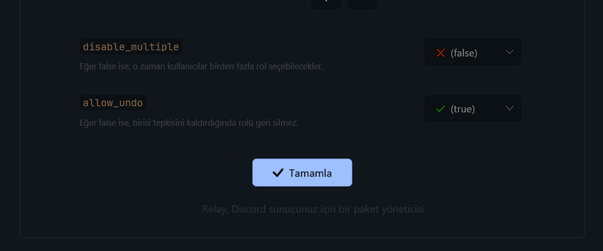
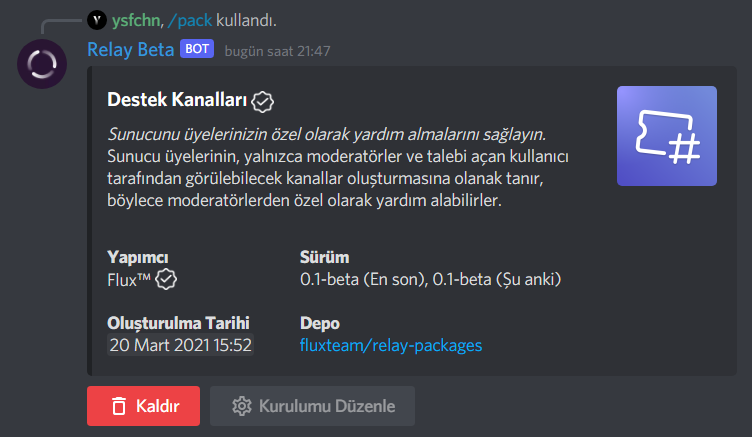

--8<-- "article_wip.txt"

# Paketler {: #title }

Relay Paketleri, insanların daha önceden oluşturduğu Relay komutlarını veya eklentilerini kendi sunucunuza zahmetsiz bir şekilde kurmanıza ve kullanmanıza olanak sağlayan bir araçtır.

!!! warning "Yetki gerekli"
    Paketleri yüklemek için sunucuda "Sunucuyu Yönet" izninizin olması gerekiyor. Eğer izniniz yoksa, sizden daha yetkili birine bu işlemi yapmasını isteyin.

Paketler ikiye ayrılır. Bunlar Kullanıcı ve Geliştirici paketleridir. Kullanıcı paketleri, az özelleştirmeye sahip fakat kullanması ve oluşturması kolaydır. Geliştirici paketleri ise, daha fazla olanak tanır fakat ek bilgiye sahip olmayı gerektirebilir.

---

## Kullanıcı Paketleri {: #user-package }

Kullanıcı paketleri, Blok Editörü üzerinden blokları dışa aktarıp, halka açık bir GitHub deposunda paylaşılarak oluşturulan paketlerdir. Herhangi bir kısıtlama veya onaya ihtiyaç duymadan kendi paketinizi oluşturabilir ve paylaşabilirsiniz.

### Paket oluşturma {: #user-package-create }

Paketin içinde bulundurmak istediğiniz dinleyicileri seçmek için dinleyiciye sağ tıklayıp "Dışa aktarmak için işaretle" seçeneğini seçin. Dışa aktarmak istediklerinizi seçtikten sonra ekranın altındaki mesaja tıklayarak veya çalışma alanına sağ tıklayıp "Blokları dışa aktar (Seçili)" seçeneğini seçerek dışa aktarmayı tamamlayın.

İsterseniz, çalışma alanın tamamını da dışa aktarabilirsiniz. Çalışma alanında boş bir alana sağ tıklayıp "Blokları dışa aktar (Tümü)" seçeneğine tıklarsanız, tüm blokları dışa aktarırsınız.

Unutmayın ki dinleyici olmayan bloklar (yalnız kalan bloklar) dışa aktarmalara dahil edilmez, çünkü yalnız başlarına bir işe yaramazlar.

Bloklarınızı dışa aktardıktan sonra, tüm dünya ile paylaşmak için [GitHub üzerinde yeni bir depo :octicons-link-external-16:](https://github.com/new){ target="_blank" } oluşturun.

!!! warning "Deponun 'Herkese Açık' olduğundan emin olun."
    Gizli ("Private") depolara sadece siz erişebildiğinizden dolayı, Relay deponuzdaki içerikleri okuyamaz. Bu yüzden devam etmeden önce deponuzun Herkese Açık ("Public") olduğundan emin olun.

Dışa aktardığınız dosyayı, deponun köküne sürükleyip bırakarak (veya bilgisayarınızdan seçerek) deponuza yükleyin. İşlemi bitirmek için "Commit changes" tuşuna basın.

Yapmanız gereken her şeyi tamamladınız! İsterseniz, insanları direkt olarak Relay'e yönlendirmek için Relay tuşu da ekleyebilirsiniz. Bu sayede, deponuzu gören insanlar, bu deponun bir Relay paketi olduğunu anlayabilirler.

### Relay tuşu {: #user-package-button }

Relay tuşu, oluşturduğunuz paketi kurmak için gereken yere yönlendiren bir butondur. Bu buton, paketinizin kurulum sayfasına yani `/packages/<paket-kodu>`'na yönlendirir. Kendi deponuzun butonunu markdown formatında oluşturmak için aşağıdaki aracı kullanabilirsiniz.

 
Depo URL'si: 
<input class="md-input" type="text" id="repo_url" placeholder="https://github.com/ysfchn/relay-hello-world" style="margin-top: 10px; width: max(50%, 200px);"> 
<pre id="repo_url_generated" style="white-space: pre-wrap;"></pre>
<button class="md-button md-button--primary primary-button" onclick="generateUrl(this);">Markdown oluştur</button>

### Paket yükleme {: #user-package-install }

Paket yüklemek için, depoda (varsa) Relay yükleme tuşuna tıklayıp bir sunucu seçip "Yükle" tuşuna basabilir, veya `https://app.relay.ysfchn/deploy?repo=DEPO_URL` (`DEPO_URL` kısmını deponun URL'si ile değiştirin) bağlantısını ziyaret edebilirsiniz.

---

## Geliştirici Paketleri {: #developer-package }

!!! warning "Geliştirici paketleri askıya alınmıştır."
    Geliştirici paketleri, Kullanıcı paketlerinden önce Relay'e eklenmişti. Fakat an itibariyle Kullanıcı paketleri, Geliştirici paketlerindeki çoğu özelliğin yerini doldurduğundan ve daha basit olduğundan dolayı, Geliştirici paketleri bir süreliğine askıya alınmıştır. Var olan paketler çalışmaya devam edecek, fakat yeni paket oluşturma an itibariyle mümkün değildir. 

### Paket yükleme {: #developer-package-install }

Paket kurmaya başlamak için mesaj yazabildiğiniz herhangi bir kanala:

* `/pack` komutunu yazıp Relay'in komutunu seçin, <kbd>TAB</kbd> tuşuna basarak kurmak istediğiniz paketin kodunu girin.
* Son olarak <kbd>Enter</kbd> tuşuna basarak komutu gönderin.

Paketin ayrıntılarını gördükten sonra paketi kurmak için "Kur" tuşuna tıklayın. Relay, paketin ayarlarını girmeniz için bir bağlantı gönderecek. Devam etmek için bağlantıyı tarayıcınızda açın. 

Eğer Discord hesabınızla giriş yapmadıysanız, Relay ilk önce sizi Discord'la giriş yapmanız için bir yetkilendirme sayfasına yönlendirecek. Yetkilendirme sayfasında "Yetkilendir" tuşuna basarak devam edin.

Paket yükleme ekranında, gereken ayarları girin. 

* Kanal veya rol girmeniz gerektiğinde, Relay sizin için sunucunuzdaki rollerin ve kanalların bir listesini otomatik olarak gösterir.
* Yıldız ile işaretlenmiş parametreleri boş bırakamazsınız, ancak yıldız ile işaretlenmeyen parametreleri boş bırakabilirsiniz.
* Eğer parametre birden fazla değer yazmanıza izin veriyorsa, :octicons-plus-16: ve :octicons-dash-16: tuşları ile daha fazla değer ekleyebilirsiniz veya eklediklerinizi silebilirsiniz.

İşiniz bittikten sonra "Tamamla" tuşuna tıklayın. Eğer girdiğiniz değerlerde bir sorun varsa sayfanın üstünde hata mesajı gözükecektir. Her şeyi doğru girdiyseniz, paketin başarıyla yüklendiğine dair bir sayfaya yönlendirilirsiniz.

Tebrikler paketi başarıyla sunucunuza kurdunuz!

??? question "Sorun giderme"
    **Paketi kurma tuşunda 'İzinler yetersiz' yazıyor.** 
    Paketleri yönetebilmek için "Sunucuyu Yönet" izninizin olması gerekiyor. Eğer izniniz yoksa, sizden daha yetkili bir
    kişiden bunu yapmasını isteyin.

    **Discord hesabımla giriş yapmaya çalıştığımda sürekli tekrar tekrar giriş yapmamı istiyor.** 
    Tarayıcınızın çerezleri kapalı olabilir. Lütfen tarayıcınızın ayarlarını kontrol edin.

    **Web sitesinde "Tamamla" tuşuna basınca hiçbir şey olmuyor.** 
    Lütfen Javascript'i devre dışı bırakmadığınızdan ve internete bağlı olduğunuzdan emin olun.

    **Yanlış kişi ile giriş yaptım, nasıl hesap değiştirebilirim?** 
    Sayfanın sağ üstündeki "Sen değil misin?" bağlantısına tıkladıktan sonra gelen Discord yetkilendirme penceresinde de yine aynı seçeneği seçerek hesap değiştirebilirsiniz.

    **Paketi kurmak istediğim sunucuyu nasıl değiştirebilirim?** 
    Paketi kurmak istediğiniz sunucuda aynı şekilde `/pack` komutunu çalıştırabilirsiniz, veya zamandan tasarruf etmek istiyorsanız paket kurma sayfasında iken tarayıcı adres çubuğundaki sunucu ID'sini değiştirebilirsiniz.

### Paket kaldırma {: #developer-package-uninstall }

Paket kaldırmaya başlamak için mesaj yazabildiğiniz herhangi bir kanala:

* `/pack` komutunu yazıp Relay'in komutunu seçin, <kbd>TAB</kbd> tuşuna basarak kurmak istediğiniz paketin kodunu girin.
* Son olarak <kbd>Enter</kbd> tuşuna basarak komutu gönderin.

Paketin ayrıntılarını gördükten sonra paketi kaldırmak için "Kaldır" tuşuna tıklayın. Yanlışlıkla tıklamadığınızdan emin olmak için Relay sizden tekrar tuşa tıklamanızı isteyecektir. Onaylamak için tuşa tekrar tıklayın.

İşlem tamamlandığında, işlemin tamamlandığına dair bir mesaj görürsünüz.

Tebrikler paketi başarıyla sunucunuzdan kaldırdınız!

### Paket oluşturma {: #developer-package-create }

Kendi paketinizi oluşturmak için gereken adımları [Geliştiriciler](developers) sayfasına bulabilirsiniz. Relay'e katkıda bulunduğunuz için çok teşekkürler!